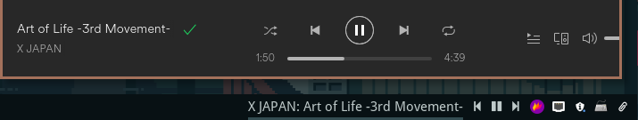

# polybar-spotify-controls

A pair of scripts to enable clickable controls for the Spotify client on [Polybar](https://github.com/polybar/polybar)



## Dependencies

-   Python
-   dbus

## Setup

First of all, we're gonna need the polybar-spotify script develop by Jesse van Rhijn (https://github.com/Jvanrhijn/polybar-spotify).

This script enables you to see the current song data as showed above.

As for settings, in my polybar config file I have:

```
[module/spotify]
type = custom/script
interval = 1
format = <label>
format-underline = ${xrdb:color1}
exec = python ~/.config/polybar/polybar-spotify/spotify_status.py -t 60 -f '{artist}: {song}'
```

After polybar-spotify is setup, we can then add the settings for the control scripts:

```
[module/nextSpotify]
type = custom/script
interval = 1
exec = $HOME/.scripts/spotify-status -q && echo ""
click-left = $HOME/.scripts/spotify-controls next

[module/prevSpotify]
type = custom/script
interval = 1
exec = $HOME/.scripts/spotify-status -q && echo ""
click-left = $HOME/.scripts/spotify-controls prev

[module/playPauseSpotify]
type = custom/script
interval = 1
exec = $HOME/.scripts/spotify-status
click-left = $HOME/.scripts/spotify-controls play-pause
``
```

In this case, I left both scripts in the .scripts directory in my home.

**Make sure to have both scripts with executable privileges with chmod +x!**

There's definitely ways in which this solution could be improved but for now it works!

## Credits

Based on [Dieter Van Hoof](https://github.com/dietervanhoof/polybar-spotify-controls) solution.
